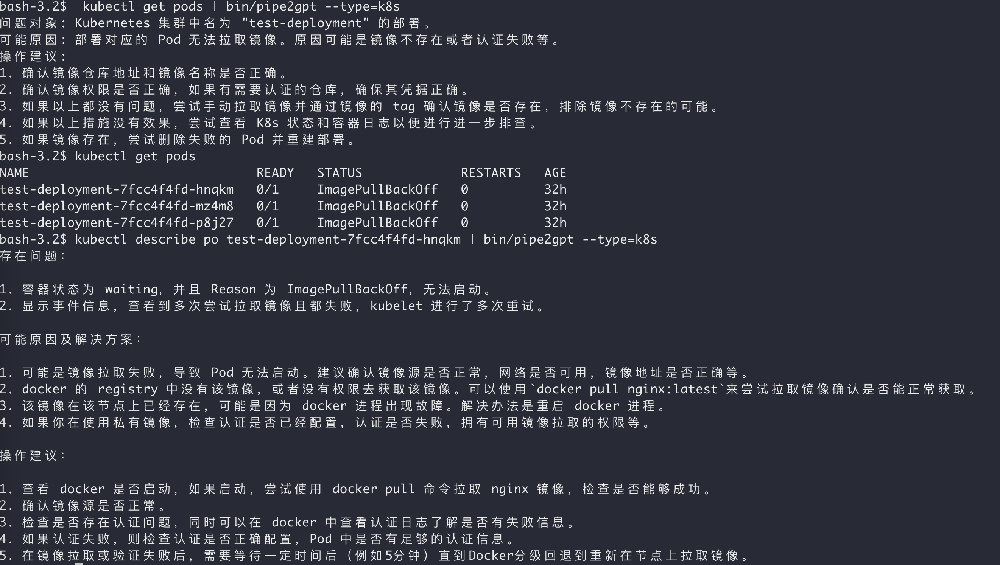

# Pipe2GPT

这个项目最有趣的一个点是：本项目包含的所有文件的绝大部分内容，都是由 ChatGPT 生成的。

Pipe2GPT 是一个使用 Go 编写的命令行工具，用于与 OpenAI GPT-3.5-turbo 模型进行交互。用户可以从 `conf.json` 文件中获取指定类型的 prompt，并将从标准输入获取的文本一起作为 GPT-3.5-turbo 模型的输入。程序通过 OpenAI API 发送请求并获取模型生成的回复，然后将回复内容输出到控制台。

~~~command
$ kubectl describe po test-deployment-7fcc4f4fd-p8j27 | bin/pipe2gpt --type=k8s
~~~

## 开始

### 安装

1. 确保您已安装 [Go](https://golang.org/doc/install) 。
2. 克隆此仓库到您的本地计算机。
3. 进入项目根目录，运行 `./build.sh` 以构建项目。
4. 配置环境变量 `OPENAI_TOKEN`。

### 使用

修改 `conf.json` 文件，添加您需要的 Prompt 类型，用管道将命令行输出内容给 Pipe2GPT。

例如：`kubectl get pods | pipe2gpt --type=k8s`

## 注意事项

请确保您已在系统中设置了 OpenAI API 密钥（环境变量 `OPENAI_TOKEN`）。

## 许可

用 MIT 许可。有关详细信息，请参阅 LICENSE 文件。

## 变更历史

v0.0.5  2023 年 03 月 25 日，使用 ChatGPT 编写了 `release.yml`，进行二进制的构建和发布。

---

The most interesting aspect of this project is that the vast majority of the contents in all of the files are generated by ChatGPT.

Pipe2GPT is a command-line tool written in Go that interacts with the OpenAI GPT-3.5-turbo model. Users can obtain a specific type of prompt from the `conf.json` file and use it along with the text obtained from standard input as input to the GPT-3.5-turbo model. The program sends requests through the OpenAI API and receives the model-generated responses, which are then output to the console.

~~~command
$ kubectl describe po test-deployment-7fcc4f4fd-p8j27 | bin/pipe2gpt --type=k8s
~~~

## Getting Started

### Installation

1. Ensure you have [Go](https://golang.org/doc/install) installed.
2. Clone this repository to your local machine.
3. In the project root directory, run `./build.sh` to build the project.
4. Set up the environment

### Usage

To modify the conf.json file, add the prompt type(s) you need and pipe the command line output to pipe2gpt.

For example: `kubectl get pods | pipe2gpt --type=k8s`

## Notes

Make sure you have set the OpenAI API key (environment variable OPENAI_TOKEN) in your system.

## License

This project is licensed under the MIT License. For more information, see the LICENSE file.

## Change Log

v0.0.5, March 25th, 2023, used ChatGPT to write release.yml for binary build and deployment.